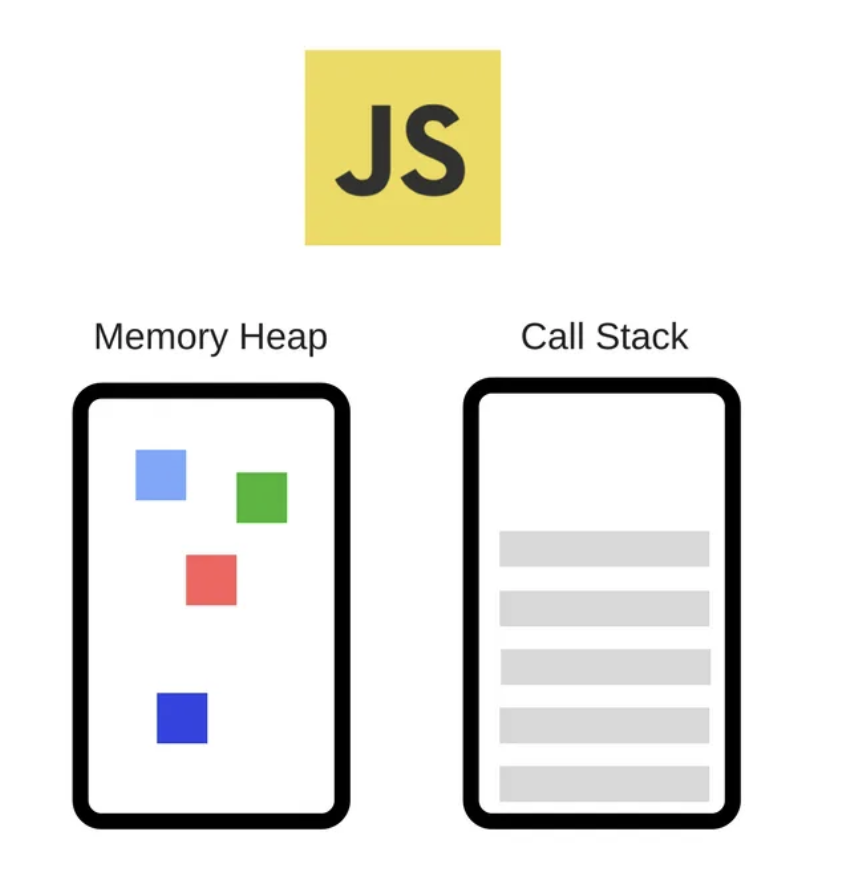
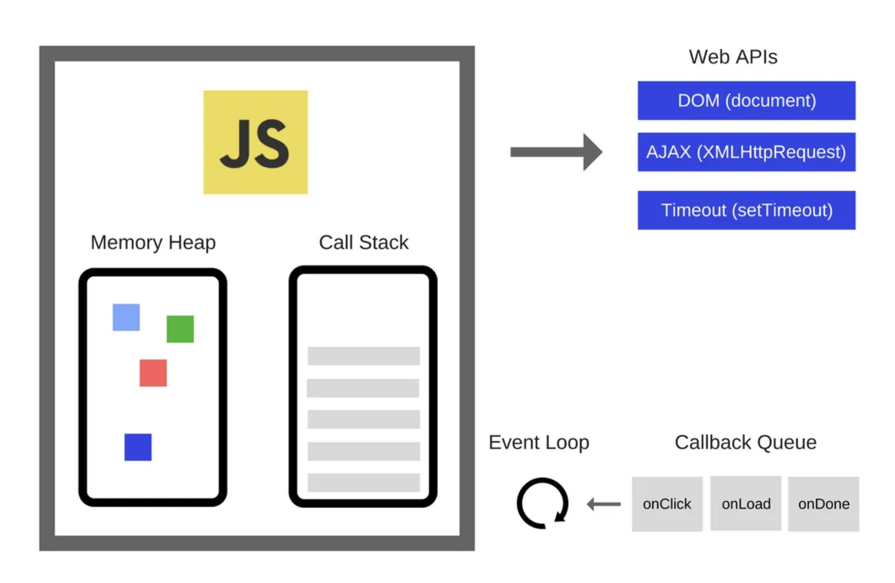

# Javascript 동작원리 (Single thread, Event loop, Asynchronous)

JS 는 싱글스레드로 동작하는 언어.

메인 스레드, 하나의 스레드로 구성

싱글 스레드는 말 그대로 한번에 하나의 작업만 수행할 수 있음을 의미.  
다른 작업이 중간에 끼어들 수 없고, 기존에 수행하던 작업이 끝나야 그 다음 작업가능

싱글 스레드인데 어떻게 동시성?

JS 의 런타임은 메모리 힙과 콜스텍으로 구성되어있다.

메모리 힙: 메모리 할당을 담당하는 곳.
콜스택: 코드가 호출되면서, 스택으로 쌓이는 곳

콜스택으로 쌓이면 LIFO, Last In First Out 으로 실행된다.

```
const foo = () => {
  bar()
  console.log('foo')
}
const bar = () => {
  console.log('bar')
}
foo();
console.log('foo and bar')
```

출력 순서는 다음과 같다.

```
bar
foo
foo and bar
```

콜스택 순서

1. foo 함수 실행
2. foo 함수 내부에서 bar 함수 실행
3. console.log(‘bar’) 실행 후 콜스택에서 제거
4. bar 함수 모두 실행되었으니 제거
5. foo 함수로 돌아와서 console.log(‘foo’) 실행 후 콜스택에서 제거
6. foo 함수 모두 실행되었으니 제거
7. console.log(‘foo and bar’)가 콜스택에 추가, 실행 후 제거

### Javascript 런타임은 자체적으로 비동기를 지원하는가?

Javascript를 사용하는 상당수의 개발자분들이 오해하고 계신 부분이,  
Javascript의 런타임 자체에서 비동기 API를 지원한다는 점입니다.
**이는 틀린 사실**

#### 동시성을 보장하는 비동기, 논블로킹 작업들은 Javascript 엔진을 구동하는 런타임(Runtime) 환경에서 담당합니다. 여기서의 런타임 환경이란, 브라우저 혹은 Node.js를 말합니다.

(서버의 경우 Node.js)

JS 의 엔진은 단지 임의의 코드에 대한 온디멘드 실행환경.  
각 이벤트를 스케줄링 하는 것은 그것을 둘러싸고 있는 환경이며..
비동기 작업들도 이러한 환경에서 지원한다.



위 이미지가 JS의 엔진과 외부의 런타임 환경들이 조합된 모습. 이벤트 루프, 콜백 큐 등 익숙한 용어들이 보인다. web api 도 보이지만 서버인 Node.js 가 런타임 환경인 경우, Node.js 가 지원하는 라이브러리 및 api 등을 사용.

콜백 큐 대신 태스크 큐라고도 불린다.

**이벤트 루프**: 이벤트 발생 시 호출되는 콜백 함수들을 관리하여 태스크 큐에 전달하고, 태스크 큐에 담겨있는 콜백 함수들을 콜스택에 넘겨줍니다.

- 이벤트 루프가 태스크 큐에서 콜스택으로 콜백 함수를 넘겨주는 작업은 콜스택에 쌓여있는 함수가 없을때만 수행됩니다.

**태스크 큐**: web api에서 비동기 작업들이 실행된 후 호출되는 콜백함수들이 기다리는 공간입니다. 이벤트 루프가 정해준 순서대로 줄을 서있으며, FIFO(First In First Out) 방식을 따릅니다.

- 태스크 큐는 하나의 큐로 이루어있지 않습니다. Microtask Queue, Animation Frames 등 여러개의 큐로 이루어져 있습니다. 단, 이 글에서는 이해의 편의를 위해 Task Queue로 통합하여 명칭합니다.

**Web api**: Web api는 브라우저에서 자체 지원하는 api입니다. Web api는 Dom 이벤트, Ajax (XmlHttpRequest), setTimeout 등의 비동기 작업들을 수행할 수 있도록 api를 지원합니다.

- 다음 글에서 Node.js의 Event loop에 대해 더 알아보도록 하고, 이번 글에서는 런타임 환경을 브라우저로 가정하도록 하겠습니다.

### 런타임 환경에서 어떻게 비동기 코드가 실행되는가?

JS 코드들이 실행될 때 Web Api 가 지원하는 비동기 작업을 수행하는 코드가 실행된다고 생각해봅시다.  
비동기 작업을 수행하는 코드는 아래의 순서로 실행됩니다.

1. 먼저 이 코드는 호출스택에 쌓인 수 실행되면, JS의 엔진은 비동기 작업을 Web api 에게 위힘합니다.
2. Web api 는 해당 비동기 작업을 수행하고 콜백 함수를 이벤트 루프를 통해 테스크 큐에 넘겨주게 된다.
3. 이벤트 루프는 콜스택에 쌓여있는 함수가 없을 때에, 태스크 큐에서 대기하고 있던 콜백함수를 콜스택으로 넘겨줍니다
4. 콜스택에 쌓인콜백함수가 실행되고, 콜스택에서 제거됩니다.

위에서 언급했었던 논블로킹 I/O의 개념이 이 부분을 통해 설명된다.

만약 http 요청의 작업을 동기로 수행했다면 해당 함수가 콜스택에 쌓인채로 머물것이고, JS엔진은 해당 작업이 끝날때까지 어떠한 작업도 수행할 수 없다.  
즉, 동기 작업이 다른 코드들을 블로킹한 것.
그러나 Javascript는 비동기 작업들을 Web api에게 넘겨줌으로써, 해당 작업이 완료될때까지 다른 코드들을 실행할 수 있다.  
이것이 바로 논블로킹!!

간단한 예시

```
console.log('첫번째로 실행됩니다.');
setTimeout(() => console.log('최소 1초 후에 실행됩니다.'), 1000);
console.log('언제 실행될까요?');
```

```
첫번째로 실행됩니다.
언제 실행될까요?
최소 1초 후에 실행됩니다.
```

1. 제일 먼저 console.log(‘첫번째로 실행됩니다.’)가 콜스택에 쌓이고, 이는 바로 실행되어 제거됩니다.
2. 그 다음으로 setTimeout이 콜스택에 쌓입니다. setTimeout이 실행되고, Web api에서 timer가 생성됩니다.
3. console.log(‘언제 실행될까요?’)가 콜스택에 쌓인 후, 바로 실행되고 제거됩니다.
4. Web api에서 생성된 timer는 생성된 시점을 기준으로 최소 1초 후에 태스크 큐로 콜백함수를 전달합니다.
5. 태스크 큐에 전달되어있던 setTimeout의 콜백함수가 콜스택에 스택이 없는것을 확인한 후, 콜스택에 호출되어 실행됩니다.

만약 setTimeout의 시간을 0초로 둔다면?

```
console.log('첫번째로 실행됩니다.');
setTimeout(() => console.log('최소 0초보다 늦게 실행됩니다.'), 0);
console.log('언제 실행될까요?');
```

```
첫번째로 실행됩니다.
언제 실행될까요?
최소 0초보다 늦게 실행됩니다.
```

결과는 바뀌지 않습니다. 시간이 중요한 것이 아닙니다.

setTimeout 함수는 web api가 지원하는 비동기 함수라는 점이 중요합니다.
setTimeout의 콜백함수는 바로 콜스택에 쌓이는 것이 아니라, web api에서 비동기 처리된 후 콜백함수가 태스크 큐에 전달됩니다.

즉, 시간을 0초로 해놨을지라도, 콜스택에 바로 쌓이는 다른 함수들보다 늦게 호출되는 것입니다.

여기서 한 걸음 더 나아가 보면  
setTimeout은 인자로 콜백함수와 딜레이 시간을 가진다.
여기서 딜레이 시간은 정확한 시간일까요?

**그렇지 않습니다.** 만약 setTimeout의 콜백함수가 태스크 큐에 쌓인다 할지라도,  
콜스택에 얼마나 많은 함수들이 쌓여있는지 여부에 따라 실행되는 시간이 지연될 수 있습니다.

지금까지 Javascript의 작동원리들을 살펴보며, **Javascript가 싱글스레드 기반이지만, 어떻게 비동기 작업을 수행하는지, 동시성을 가질 수 있는지, 논블로킹 I/O**가 가능한지에 대해서 알아보았습니다.

참조: https://medium.com/@vdongbin/javascript-%EC%9E%91%EB%8F%99%EC%9B%90%EB%A6%AC-single-thread-event-loop-asynchronous-e47e07b24d1c
