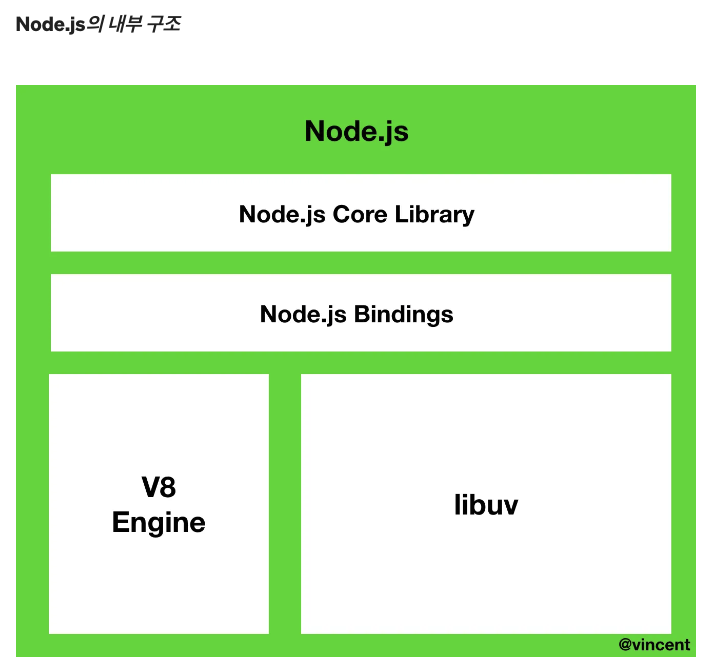
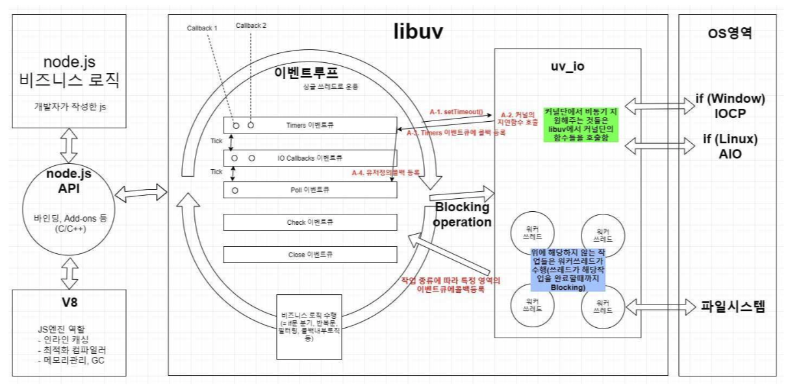

# Node.js 동작원리 (Single thread, Event-driven, Non-Blocking I/O, Event loop)

Node.js 란 무엇인가요?
단 한마디로 Node.js를 표현하자면, **Javascript를 브라우저 밖에서도 실행할 수 있도록 하는 Javascript의 런타임**.

아래는 Node.js 공식 사이트에 게시된 Node.js의 설명 글.

```
Node.js®에 대해서
비동기 이벤트 주도 JavaScript 런타임으로써 Node.js 는 확장성 있는 네트워크 애플리케이션을 만들 수 있도록 설계되었습니다
```

이번에 알아 볼것: 비동기(Asynchronous), 이벤트 주도 (Event-driven), Non-Blocking I/O, 확장성

**프로세스(Process)와 스레드(Thread)**에 대한 개념 먼저

```
프로세스: 메모리에 올라와 실행되고 있는 프로그램의 인스턴스. 실행되고 있는 프로그램(독립적인 개체).

스레드: 프로세스 내에서 할당받은 실행의 단위. 스레드는 프로세스 당 CPU의 코어 개수만큼 생성될 수 있습니다.

* 스레드는 프로세스 내의 메모리 공간을 공유하지만, 각각의 프로세스는 별도의 메모리 공간을 갖습니다.
```

싱글스레드는 프로세스 내에서 하나의 스레드가 하나의 요청만을 수행.  
해당 요청이 수행될 때 다른 요청을 함께 수행할 수 없다.  
이를 **싱글스레드 블로킹 모델**.  
진행되고 있는 요청이 예정되어 있는 요청을 블로킹하기 때문.

반면에 멀티스레드는 스레드 풀에서 실행의 요청만큼 스레드를 매칭하여 작업을 수행.  
언뜻 보면 멀티스레드가 훨씬 좋아보이지만, 멀티스레드는 효율성 측면에서 큰 단점을 갖고 있다.  
스레드 풀에 **스레드가 늘어날수록 CPU 비용을 소모**하고,  
만약 **요청이 적다면 놀고있는 스레드**가 생기기 때문.

Node.js는 **싱글스레드 논블로킹** 모델로 구성되어 있습니다.  
하나의 스레드로 동작하지만, 비동기 I/O 작업을 통해 요청들을 서로 블로킹하지 않습니다.  
즉, **동시에 많은 요청들을 비동기로 수행함으로써 싱글스레드일지라도 논블로킹**이 가능합니다.  
또한 Node.js는 클러스터링을 통해 **프로세스를 포크(fork)**하여 멀티스레드인것 처럼 사용될 수 있습니다.  
트래픽에 따라서 프로세스를 포크할 수 있으므로 서버의 확장성이 용이하다는 장점을 갖습니다.



```
* Node.js는 Javascript와 C++언어로 구성되어 있습니다. V8엔진도 70% 이상의 C++로 구성되어 있으며, libuv는 100%의 C++언어로 구성된 라이브러리 입니다. 하지만 우리는 C/C++언어를 몰라도  Node.js는 사용할 수 있습니다. 이는 V8 엔진에서 Javascript를 C++로 Translate 해주기 때문에 가능한 일입니다. 또한 Node.js의 코어 라이브러리는 process.binding()을 통해 Javascript 환경에서 사용될 수 있습니다. 예를 들어 Node.js의 내장 모듈인 crypto는 원래 C++ 언어로 작성되어 있습니다.

* Node.js에 동작하는 이벤트 루프는 libuv 내에서 구현됩니다. 이벤트 루프가 libuv 내에서 실행된다고 해서, Javascript의 스레드와 이벤트 루프의 스레드가 별도로 존재한다고 생각하실 수 있습니다. 하지만 Node.js는 싱글스레드이기 때문에 하나의 이벤트 루프를 갖으며, 하나의 스레드가 모든 것을 처리합니다.
```

Node.js를 크게 나눠봤을 때, 내장 라이브러리와 v8엔진 그리고 **libuv**로 구성되어 있습니다. Node.js의 특성인 이벤트 기반, **논블로킹 I/O 모델들은 모두 libuv 라이브러리에서 구현**됩니다.

Node.js에서 작성되는 거의 모든 코드들은 콜백함수로 이루어져 있습니다. 콜백함수들은(심지어 if문까지) libuv 내에 위치한 이벤트 루프에서 관리 및 처리된다고 위에서 언급했습니다.

이벤트 루프는 **여러 개의 페이즈(Phase)**들을 갖고 있으며, 해당 페이즈들은 각자만의 큐(Queue)를 갖습니다. 이벤트 루프는 **라운드 로빈(round-robin)** 방식으로 노드 프로세스가 종료될때까지 **일정 규칙에 따라 여러개의 페이즈들을 계속 순회**합니다.

페이즈들은 각각의 큐들을 관리하고, 해당 큐들은 FIFO(First In First Out) 순서로 콜백함수들을 처리합니다.

Node.js는 완전한 싱글 스레드일까?
Node.js는 자바스크립트 런타임이며, 자바스크립트는 메인 스레드 하나를 가진 싱글 스레드이다. 즉, Node.js는 싱글 스레드이다.

그러나, 완전하게 싱글 스레드를 기반으로 동작하지 않는다.

일부 블로킹 작업들은 libuv의 스레드 풀에서 수행되기 때문이다.

# 이벤트 주도(이벤트 기반, Event-Driven)

이벤트 주도란 이벤트가 발생할 때 미리 지정해둔 작업을 수행하는 방식을 의미한다. **Node.js는 이벤트 리스너에 등록해둔 콜백 함수를 실행하는 방식**으로 동작한다.

이벤트가 발생할 때 미리 지정해둔 작업을 수행하는데, 이를 모니터링하는 것이 바로 **이벤트 루프이다. 이 이벤트 루프는 브라우저 런타임과 다르다.**



참조: https://medium.com/@vdongbin/node-js-%EB%8F%99%EC%9E%91%EC%9B%90%EB%A6%AC-single-thread-event-driven-non-blocking-i-o-event-loop-ce97e58a8e21  
https://mniyunsu.github.io/node-loop/
