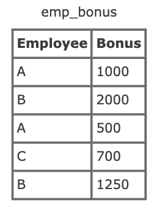
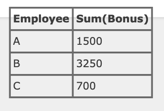

# 11. In SQL, what’s the difference between the having clause and the where clause?



```
select employee, sum(bonus) from emp_bonus group by employee;
```


Now, suppose we wanted to find the employees who received more than $1,000 in bonuses for the year of 2007. You might think that we could write a query like this:

BAD SQL:

```
select employee, sum(bonus) from emp_bonus
group by employee where sum(bonus) > 1000;
```

The WHERE clause does not work with aggregates like SUM
The SQL above will not work, because the where clause doesn’t work with aggregates – like sum, avg, max, etc.. Instead, what we will need to use is the having clause.

The having clause was added to sql just so we could compare aggregates to other values – just how the ‘where’ clause can be used with non-aggregates. Now, the correct sql will look like this:

GOOD SQL:

```
select employee, sum(bonus) from emp_bonus
group by employee having sum(bonus) > 1000;
```

참조:  
https://www.programmerinterview.com/database-sql/having-vs-where-clause/
