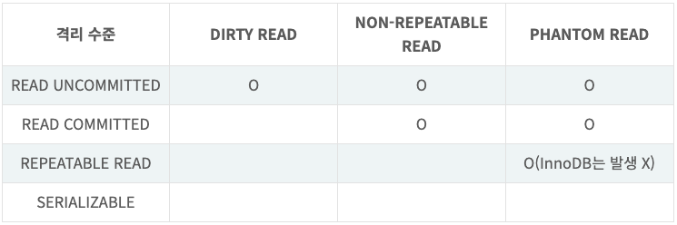
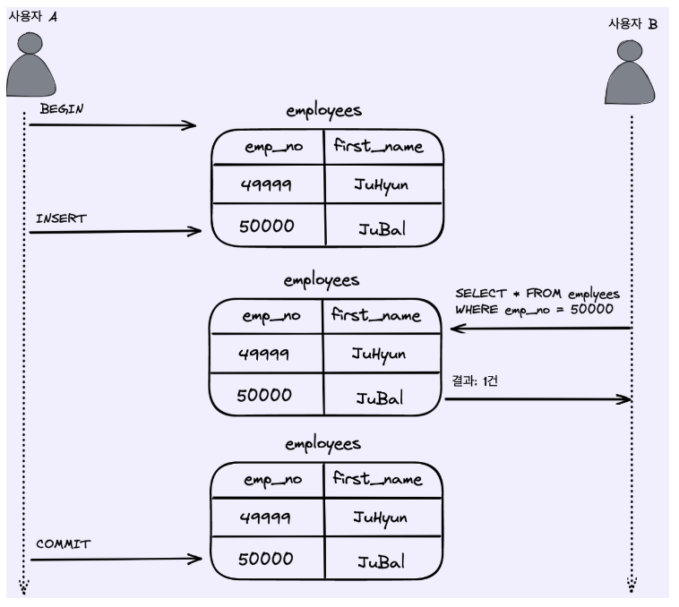
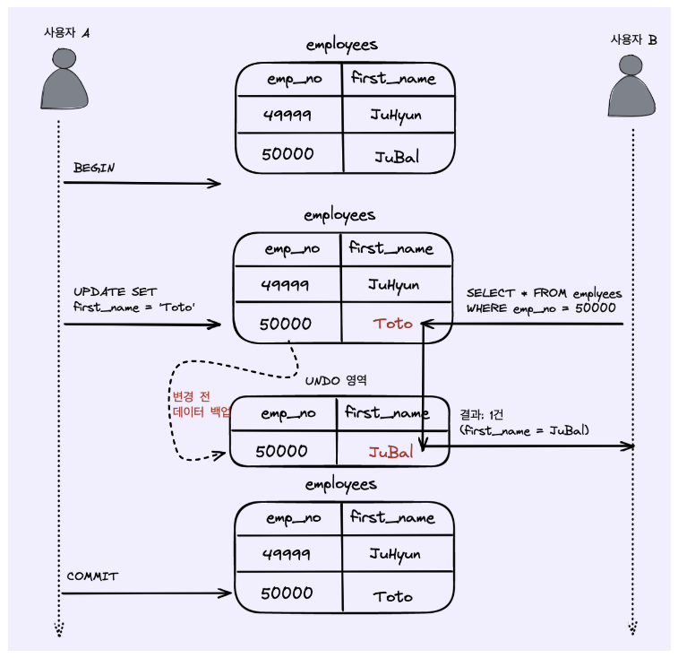
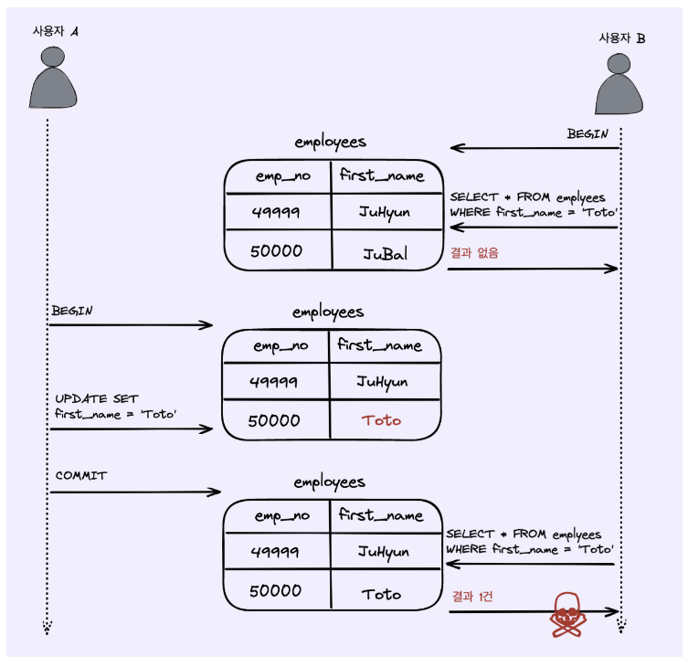
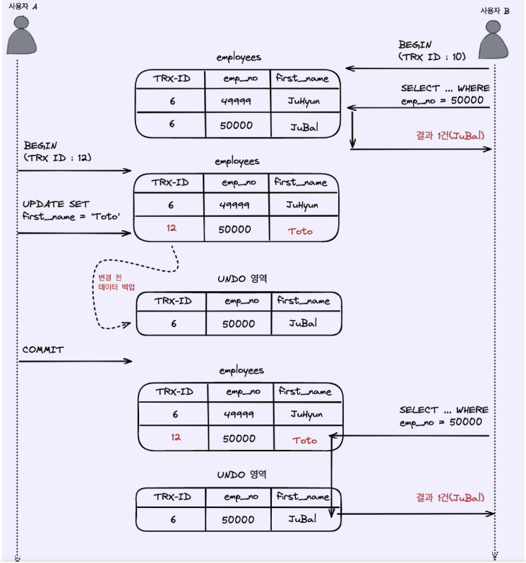

# 6. 트랜잭션 격리 수준(Transaction Isolation Levels)에 대해서 설명해주세요.

- READ UNCOMMITTED(커밋되지 않은 읽기) (격리수준 가장 낮음) (aka dirty read)
- 
- READ COMMITTED(커밋된 읽기)
- 
- 
- REPEATABLE READ(반복 가능한 읽기)
- 
- 위 그림에서 사용자 B가 BEGIN 명령으로 트랜잭션을 시작하고 first_name = 'Toto'인 사원을 조회하면 일치하는 데이터가 존재하지 않습니다.

하지만 이후에 사용자 A가 emp_no = 50000인 사원의 이름을 'Toto'로 수정하고 커밋한 후 사용자 B는 동일한 쿼리로 조회하면 이번에는 결과가 1건이 조회가 됩니다.

이는 별다른 문제는 없어보이나 사용자 B가 하나의 트랜잭션내에서 동일한 SELECT 쿼리를 실행했을 때 항상 같은 결과를 보장해야 한다는 "REPEATABLE READ" 정합성에 어긋나게 됩니다.

이러한 부정합 현상은 일반적인 웹 애플리케이션에서는 크게 문제가 되지않지만, 하나의 트랜잭션에서 동일한 데이터를 여러 번 읽고 변경하는 작업이 금전적인 처리와 연결되면 문제가 될 수 있습니다.

예를 들어, 다른 트랜잭션에서 입금과 출금 처리가 계속 진행되고 있을 때 다른 트랜잭션에서 오늘 입금된 금액의 총합을 조회한다고 가정해보겠습니다. "REPEATABLE READ"가 보장되지 않기 때문에 총합을 계산하는 SELECT 쿼리를 실행할 때마다 다른 결과를 가져올 것입니다. 중요한 것은 사용중인 트랜잭션의 격리 수준에 의해 실행되는 SQL 문장이 어떠한 결과를 가져오게 되는지 정확히 예측할 수 있어야 합니다. 그리고 이를 위해서는 각 트랜잭션의 격리 수준이 어떻게 작동하는지 알고 있어야합니다.

하나의 TRANSACTION 에서는 동일한 결과가 나와야 한다. (REPEATABLE READ)
하나의 트랜잭션이 킬링 포인트임

- SERIALIZABLE(직렬화 가능) (격리수준 가장 높음)
  가장 단순한 격리 수준이면서 가장 엄격한 격리 수준입니다. 또한 동시 처리 성능도 다른 트랜잭션 격리 수준보다 현저히 떨어집니다.

트랜잭션의 격리 수준이 SERIALIZABLE로 설정되면 읽기 작업도 공유 잠금(읽기 잠금)을 획득해야 하며, 동시에 다른 트랜잭션은 그러한 레코드를 변경할 수 없습니다. 즉, 한 트랜잭션에서 읽고 쓰는 레코드를 다른 트랜잭션에서는 절대 접근할 수 없습니다.

SERIALIZABLE 격리 수준에서는 일반적인 DBMS에서 발생하는 "PHANTOM READ" 문제가 발생하지 않지만, 위에서 설명드렸듯이 InnoDB 스토리지 엔진에서는 REPEATABLE READ 격리 수준에서도 "PHANTOM READ"가 발생하지 않기 때문에 굳이 SERIALIZABLE 격리 수준을 사용할 필요성은 없어보입니다.

참조: https://zzang9ha.tistory.com/381
