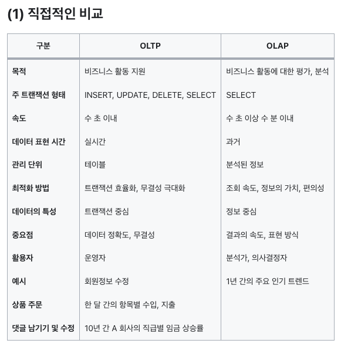

# 7. OLTP 와 OLAP 에 대해 설명해주세요.

## OLTP (Online Transaction Processing)

### OLTP의 정의

- '운영'계 데이터 및 데이터를 처리하는 방법을 의미
- 복수의 사용자 PC에서 발생되는 트랜잭션(Transaction)을 DB 서버가 처리, 그 결과를 요청한 사용자에게 결과값을 되돌려주는 과정
- 1개의 트랜잭션에서 발생되는 INSERT, UPDATE, DELETE를 무결성 보장하여 처리, 결과를 SELECT하는 과정

### OLTP의 특징

- 과거에는 주로 RDBMS 기반의 시스템을 근간으로 했으나 NoSQL도 운영계 데이터의 성격을 띤다면 OLTP로 분류 가능
- 현재 데이터가 처리가 얼마나 정확하고 무결한지가 중요
- 실질적인 데이터의 저장, 삭제, 수정 등의 작업을 의미
- 비교적 작은 규모의 트랜잭션들로 구성
- CRUD와 관련된 쿼리들이 주를 이룸
- 전통적인 DBMS들이 주로 사용됨
- 데이터 간의 구조를 잘 정리하려고 노력

참조: https://velog.io/@mrcocoball/220323OLTP-OLAP%EC%9D%98-%EA%B0%9C%EB%85%90%EA%B3%BC-%EC%B0%A8%EC%9D%B4
