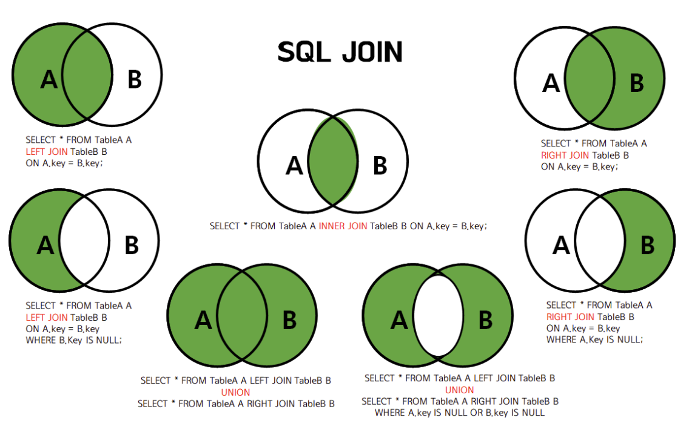

# 8. RDBMS 의 여러 JOIN 중 설명



LEFT JOIN을 여러번 할 때 주의할 점

1. INNER JOIN과는 달리 LEFT JOIN은 조인하는 테이블의 순서가 상당히 중요하다.
   어떤 순서로 테이블을 조인하는지에 따라 결과 테이블에 조회되는 행의 개수며 구성 등이 달라질 수 있다.
   따라서 JOIN 문을 작성할 때, 만약 LEFT JOIN을 할 거라면 가장 첫 번째의 테이블로 SELECT문에 가장 많은 열을 가져와야 할 테이블을 우선으로 적어준다.

2. 조인을 여러 번 해야하는데 시작을 LEFT JOIN으로 했다면 나머지 조인도 LEFT JOIN을 이어나간다.
   즉, LEFT JOIN을 쓰다가 갑자기 INNER JOIN 이나 다른 조인을 사용하지 않는다는 이야기다.

대부분 DB는 FULL OUTER JOIN을 지원하지 않는다. 하지만 간접적으로 구현하는 방법이 존재한다

UNION
UNION은 여러 개의 SELECT 문의 결과를 하나의 테이블이나 결과 집합으로 표현할 때 사용
이때 각각의 SELECT 문으로 선택된 필드의 개수와 타입은 모두 같아야 하며, 필드의 순서 또한 같아야 한다.
기본 집합 쿼리에는 (DISTINCT) 중복제거가 자동 포함되어있다.

```
SELECT 필드이름 FROM 테이블이름
UNION
SELECT 필드이름 FROM 테이블이름
```

UNION ALL
UNION은 DISTINCT 자동 포함이라 중복되는 레코드를 제거한다.
따라서 중복되는 레코드까지 모두 출력하고 싶다면, ALL 키워드를 사용하면 된다.

JOIN 전에 중복을 제거하기
앞서 말한 것처럼 SELECT DISTINCT는 간단하지만 성능이 느리다.
성능을 위해서는 JOIN 전에 중복을 제거하는 작업을 해주는 것이 좋다. (물론 더 좋은 것은 중복이 없도록 테이블 설계를 잘 하는 것이다)
JOIN 전에 중복 제거는 다음과 같이 조인할 테이블에 서브쿼리의 inline view를 사용해 distinct 하고 조인하면 된다.

````
select A.name, A.countryCode
from city A
left join ( select distinct name, Code from country ) as B
-- 조인할 테이블에 먼저 distinct로 중복을 제거한 select문을 서브쿼리로 불러와 임시테이블로 만든뒤 조인한다
on A.countrycode = B.Code```
````

언뜻보면 복잡해보일 수 있고 성능이 더 느려보일 수 있는데, 일반적으로 레코드 수가 많은 경우 JOIN 전에 중복을 제거해서 1:1 JOIN으로 바꾸는 것이 훨씬 빠르다.

물론 WHERE 절에 조건이 존재 여부, index 존재 여부, 한쪽 테이블의 크기가 엄청 적은 경우 등등 많은 시나리오가 있으니 성능 비교를 하는 것이 좋다.

출처: https://inpa.tistory.com/entry/MYSQL-%F0%9F%93%9A-JOIN-%EC%A1%B0%EC%9D%B8-%EA%B7%B8%EB%A6%BC%EC%9C%BC%EB%A1%9C-%EC%95%8C%EA%B8%B0%EC%89%BD%EA%B2%8C-%EC%A0%95%EB%A6%AC
