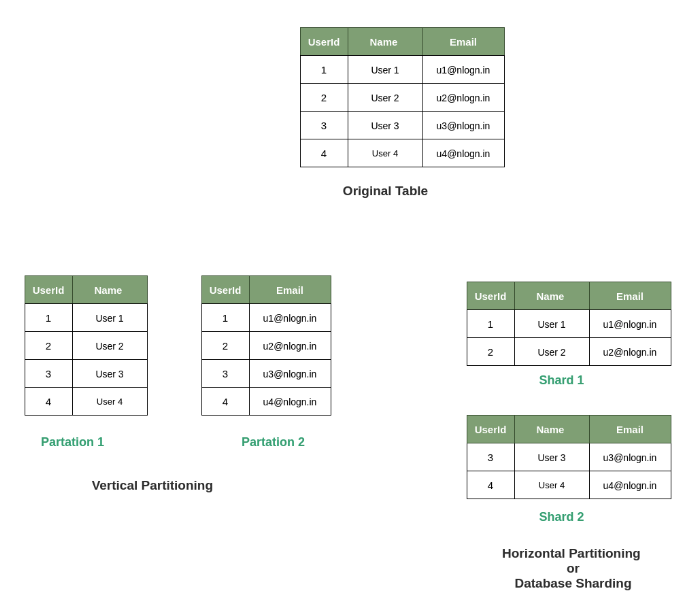
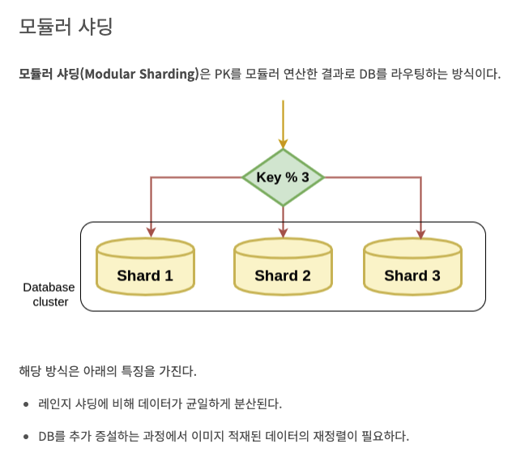
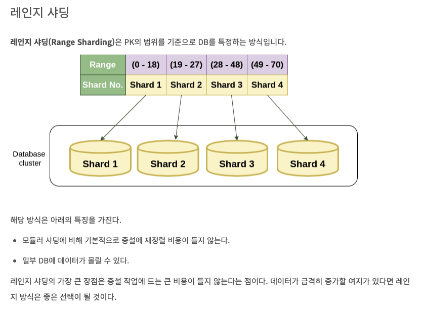
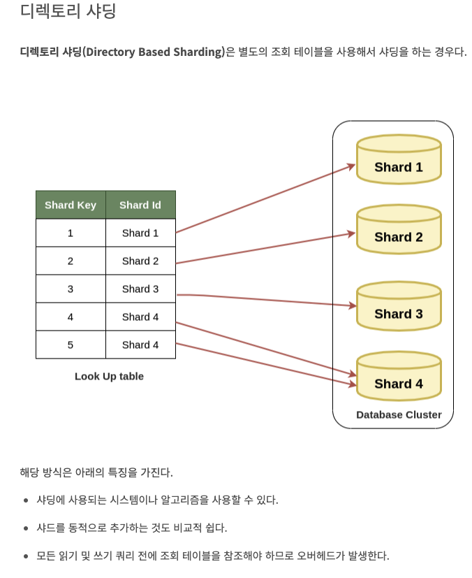

# 9. 데이터베이스 샤딩 / 파티셔닝에 대해 설명해주세요.

샤딩(Sharding)은 DB 트래픽을 분산할 수 있는 중요한 수단이다. 추가적으로 특정 DB의 장애가 전면 장애로 이어지지 않게 하는 역할도 한다.

샤딩은 각 DB 서버에서 데이터를 분할하여 저장하는 방식이다. 해당 데이터에 접근할 때는 샤딩키를 사용하여 동적으로 DB 서버를 매핑하는 과정이 필요하다.

참조: https://techblog.woowahan.com/2687/
